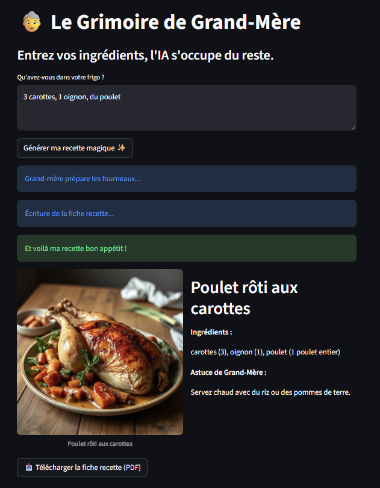

# Générateur de Recettes de Grand-Mère IA

Bienvenue sur le **Générateur de Recettes de Grand-Mère**, une application Proof of Concept (POC) orientée MLOps.

- Génération de recettes via Llama-3.1-8B (LLM)
- Génération d'images via FLUX.1 (modèle de diffusion)
- Export PDF avec une mise en page "manuscrite" (police personnalisée)
- Interface utilisateur simple avec Streamlit
- Un suivi des prompts avec MLflow

## Concept

Cette application transforme une simple liste d'ingrédients en une **fiche recette complète au format PDF**, avec le ton chaleureux et nostalgique d'une grand-mère française.

**Le workflow :**
1. L'utilisateur saisit ses ingrédients.
2. Une **IA Textuelle (LLM)** génère la recette, les étapes et une "astuce de grand-mère".
3. Une **IA Générative d'images** crée un visuel du plat.
4. L'application compile le tout dans un **PDF stylisé** prêt à être téléchargé.

## Installation et Exécution en local

### Prérequis
- Un compte Hugging Face avec un **Token d'accès** (pour utiliser les modèles).
- Saisir le token dans un fichier .env en racine du projet (HF_TOKEN=****)

### 1. Cloner le projet
```bash
git clone https://github.com/78Pauline78/Projet_MLops.git
cd Projet_MLops
```

### 2. Lancement du docker
```bash
docker-compose up --build
```

### 3. Accès a l'application
Interface Streamlit : http://localhost:8501

#### Visuels de l'application


### 4. Accès à mlflow par le docker
saisir la commande suivant à l'emplacement du fichier
```bash
docker exec -it projet_mlops-app-1 bash
```
une fois dans le docker saisir:
```bash
mlflow ui --host 0.0.0.0 --port 5000
```
Interface mlflow : http://localhost:5000

#### Visuels de MLflow


## Améliorations futures
Gestion des erreurs:
- Validation des ingrédients saisis (ex: "pierre, nuage").
- Timeout si Mistral/FLUX.1 échouent

MLOps:
- CI/CD
- Monitoring: Dashboard Grafana connecté à MLflow
